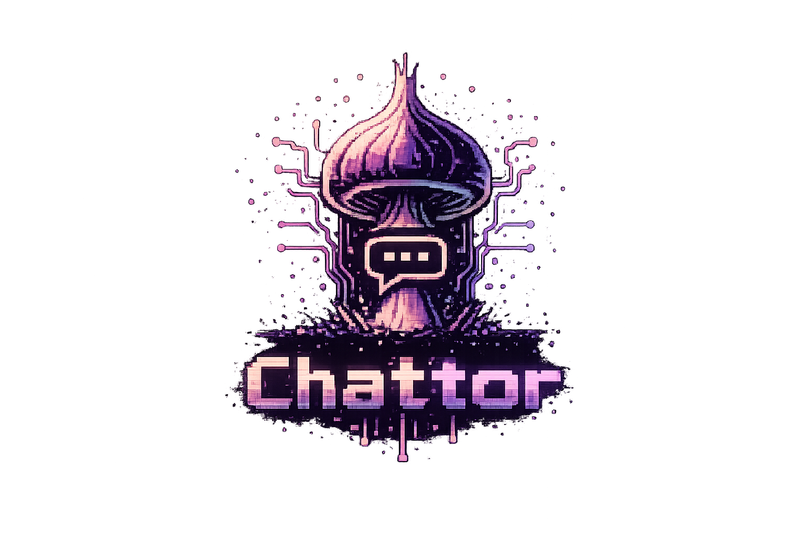

<p align="center">
  
</p>

# chattor

**Peer-to-peer encrypted chat over Tor, right in your terminal.**

A TUI chat application where each user runs their own Tor hidden service.
Messages are end-to-end encrypted with Signal Protocol (Double Ratchet),
stored in an encrypted local database, and routed entirely through Tor.
No central servers. No accounts. No metadata leakage.

Built in Rust with [ratatui](https://github.com/ratatui/ratatui).

---

## How It Works

```
You → TUI (ratatui) → Signal Protocol (E2E) → Tor Hidden Service → Peer
```

- **Identity**: Your Ed25519 keypair *is* your identity — no registration, no usernames, no servers to ask permission from. Your `.onion` address is generated by arti (embedded Tor) and persists across restarts.
- **Sending**: Messages are encrypted with Signal Protocol (X3DH key exchange + ChaCha20-Poly1305), wrapped in a JSON envelope, and sent to the recipient's hidden service over Tor via cached connection pools.
- **Receiving**: Your node runs a real Tor hidden service (via arti) that listens for incoming connections. Messages arrive encrypted and are decrypted locally.
- **Offline delivery**: If a peer is offline, messages are queued locally with exponential backoff retries (30s base, doubling to 15min cap, 24h expiry window) until delivery succeeds.

---

## Features

### Encryption & Identity

- **Signal Protocol** — real X3DH key exchange + Double Ratchet, implemented with [`libsignal-dezire`](https://crates.io/crates/libsignal-dezire) (AGPL-3.0)
- **Friend-request authentication** — every inbound friend request is verified against the Ed25519 key embedded in the sender's v3 `.onion` address; forged or backdated requests are dropped
- **Protocol versioning** — `MessageEnvelope` wrapper (currently `protocol_version: 2`) for future wire format evolution
- **Ed25519 identity** — one keypair per user, stored encrypted; `.onion` address managed by arti
- **SQLCipher** — database encrypted at rest with bundled SQLCipher (via `rusqlite`)

### Networking

- **Pure P2P over Tor** — each user hosts a real arti onion service; no central relay, no NAT traversal headaches
- **Connection pooling** — per-peer Tor circuit caching with DashMap, idle eviction (5min), retry-on-stale, and pool size cap (50)
- **Rate limiting** — per-peer token bucket rate limiter (5 req/s sustained, 20 burst), checked on every inbound message in the dispatcher
- **DoS-bounded rendezvous** — per-process cap of 256 in-flight Tor rendezvous accept tasks; Tor applies backpressure naturally when the cap is hit
- **Offline message queue** — FIFO queue with exponential backoff retries, persisted to database
- **Friend codes** — 32-word mnemonic encoding of your public key (256-word list, 8 groups of 4 words)

### Broadcast Channels

- **Public & Friends-Only** channels — two auto-created per user, with subscriber management
- **Ed25519-signed posts** — every post is cryptographically signed by the publisher, and every receiver (both direct `ChannelPost` and `ChannelSyncResponse` paths) verifies the signature against the publisher's onion-derived key before storing
- **Friends-only enforcement** — checked on inbound subscribe requests, sync requests, *and* direct posts; non-friend posts to a friends-only feed are dropped
- **Hybrid push + pull sync** — new posts are pushed to online subscribers and missed posts are pulled on demand via `ChannelSyncRequest`
- **Read receipts** — publishers see "seen by N" per post
- **100-post retention** — per `(publisher_onion, channel_type)` feed, bounding both our own channels and each subscribed publisher
- **Auto-subscribe** — friends subscribe to each other's channels on friend accept

### Terminal UI

- **7 themes** — dark, light, cyberpunk, minimal, rose-pine, rose-pine-moon, rose-pine-dawn
- **TOML config** — override any theme color via `~/.config/chattor/theme.toml`
- **Animated bootstrap** — mushroom ASCII art while connecting to Tor (it takes a moment)
- **Sidebar + conversation + channels** — friends list, chat view, and channel feed all in one layout
- **Responsive layout** — sidebar width and footer keybinding hints adapt to the terminal size; the conversation and channel views render a vertical scrollbar when content overflows
- **Real terminal cursor** in every input field — no fake block characters
- **Absolute date headers** (`──── Today ────`, `──── Wed, Mar 14 ────`) anchor old conversations alongside the per-message relative timestamps
- **Channel ops in-UI** — `s` to subscribe, `S` to browse existing subscriptions, `u` to unsubscribe from the channel you're viewing
- **Friend management** — `d` deletes the selected friend (cascading conversation + queue + session cleanup); `b` blocks their onion so subsequent inbound messages are dropped at the dispatcher
- **Multi-byte safe** — display names, onion truncations, and channel publisher labels are all character-based; no panics on CJK/emoji input
- **Clipboard support** — wl-copy, xclip, xsel, pbcopy (whatever your system has)

---

## Technical Highlights

A few pieces that were particularly interesting to build:

**Signal Protocol via libsignal-dezire** — Real X3DH key exchange and Double Ratchet implemented with `libsignal-dezire`, a pure-Rust Signal Protocol library. PreKey bundles are exchanged during friend request accept; the initiator sends a handshake PreKey message so the acceptor can establish their session. Messages are wrapped in versioned `MessageEnvelope`s for forward compatibility. Plaintext fallback was removed entirely — no session, no message.

**Embedded Tor via arti** — Real Tor onion services hosted via the pure-Rust `arti` library. Each peer's `.onion` address persists across restarts (stored in arti's state directory and cached in the database). Connection pooling reuses Tor circuits per peer, with automatic retry-on-stale and idle eviction.

**Encrypted database with full-text search** — SQLCipher provides at-rest encryption. FTS5 virtual tables with auto-sync triggers keep the search index up to date without manual bookkeeping. Schema migrations run automatically from v2 through v9.

**Theme engine** — A `Theme` struct with named color fields, 7 preset palettes, and TOML config file support. Every UI component references the theme, so swapping palettes is a single config change or CLI flag.

---

## Quick Start

```bash
# Build
cargo build --release

# Run
cargo run

# Run with a theme
cargo run -- --theme cyberpunk

# Run tests
cargo test
```

### CLI Options

| Flag | Short | Description |
|------|-------|-------------|
| `--debug` | `-d` | Enable debug logging |
| `--theme <name>` | `-t` | Theme preset: `dark`, `light`, `cyberpunk`, `minimal`, `rose-pine`, `rose-pine-moon`, `rose-pine-dawn` |
| `--config-dir <path>` | `-c` | Custom config directory |

### Two-Instance Testing

```bash
# Terminal 1
cargo run -- --config-dir /tmp/alice

# Terminal 2
cargo run -- --config-dir /tmp/bob
```

---

## Project Status

| Phase | Description | Status |
|-------|-------------|--------|
| 1 | Core Foundation | Done |
| 2 | Tor + Messaging Foundation | Done |
| 3 | Broadcast Channels | Done |
| 4 | Polish & Theming | Done |
| 5 | Crypto & Identity Hardening | Done |
| 6 | Hardening | Done |

All layers are real and tested: crypto (Signal Protocol X3DH + Double Ratchet via libsignal-dezire), Tor transport (embedded arti with real onion services), database (SQLCipher), UI (ratatui), message queue (exponential backoff), and connection pooling (DashMap with per-peer Tor circuit caching). 252 tests pass including 6 end-to-end tests covering the full friend-request → X3DH session → bidirectional messaging pipeline.

---

## Project Structure

```
src/
├── app.rs                  # Application state and initialization
├── cli.rs                  # CLI argument parsing (clap)
├── lib.rs                  # Public module declarations
├── config/
│   └── settings.rs         # Application settings and preferences
├── error.rs                # Error types (thiserror)
├── main.rs                 # Entry point, event loop, key handling
├── crypto/
│   ├── identity.rs         # Ed25519 keypair management
│   ├── signal.rs           # Signal Protocol (X3DH + Double Ratchet via libsignal-dezire)
│   └── session_store.rs    # Signal session persistence
├── db/
│   ├── connection.rs       # SQLCipher database + migrations (v2→v9)
│   ├── queries.rs          # All database queries
│   └── schema.rs           # Schema definitions (v9)
├── net/
│   ├── framing.rs          # TCP length-prefixed message framing
│   ├── listener.rs         # Incoming connection listener (Tor rendezvous)
│   ├── pool.rs             # Per-peer Tor circuit caching (DashMap) + idle eviction
│   ├── queue.rs            # Offline message queue with exponential backoff
│   ├── rate_limit.rs       # Per-peer token bucket rate limiter
│   ├── receiver.rs         # Message receiving + decryption
│   └── sender.rs           # Message sending
├── protocol/
│   ├── friend_code.rs      # 32-word mnemonic friend codes
│   ├── friend_request.rs   # Friend request protocol
│   └── message.rs          # Wire protocol (13 message types + MessageEnvelope)
├── tor/
│   ├── address.rs          # .onion address utilities
│   ├── client.rs           # Tor client wrapper (arti)
│   ├── connection.rs       # Peer connections over Tor
│   └── hidden_service.rs   # Real arti onion service hosting
└── ui/
    ├── app_ui.rs           # Main app layout
    ├── bootstrap.rs        # Bootstrap animation screen
    ├── channel_feed.rs     # Broadcast channel UI
    ├── conversation.rs     # Chat conversation view
    ├── error.rs            # User-facing error formatting
    ├── modals.rs           # Dialog modals
    ├── sidebar.rs          # Friends & channels sidebar
    ├── state.rs            # UI state management
    └── theme.rs            # Theme engine (7 presets + TOML config)
```

---

## Requirements

- **Rust** 1.70+ (edition 2021)
- **Platform**: Linux, macOS, BSD (no Windows support)
- **SQLCipher**: bundled via `rusqlite` feature flag — no system dependency needed
- **Tor**: embedded via `arti` — no system Tor installation required

## License

MIT OR Apache-2.0
